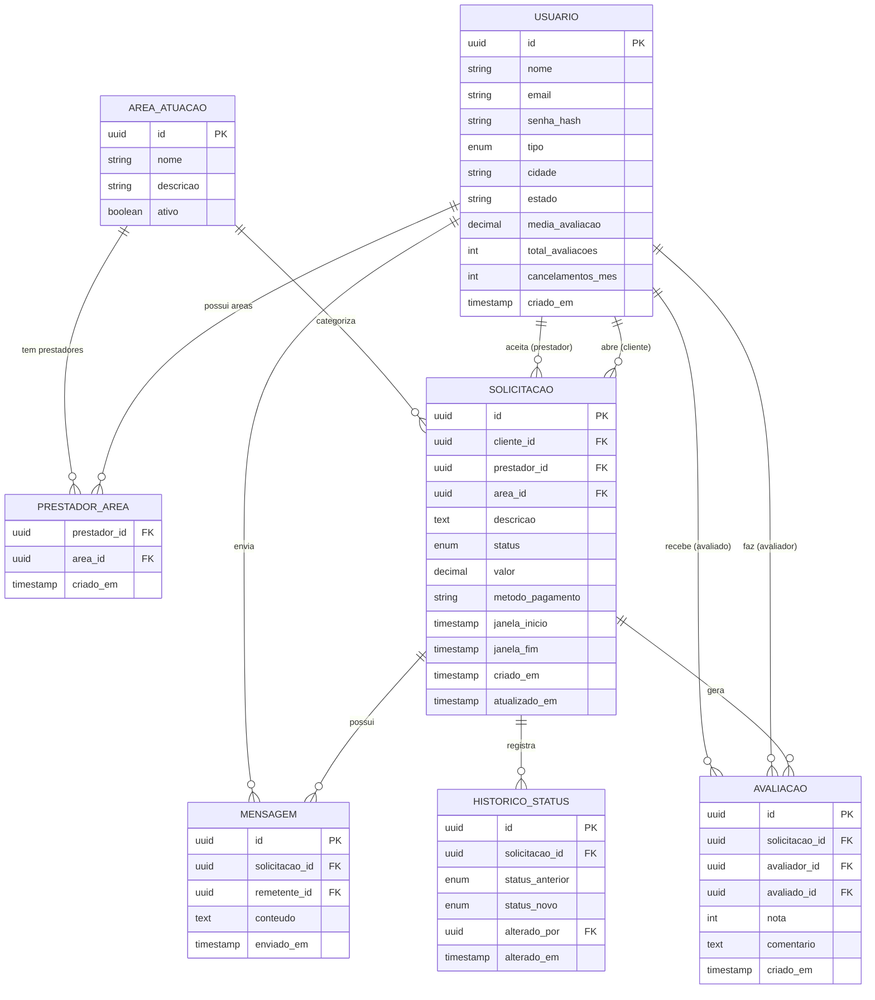

# 🔧 Projeto
 
> Plataforma de marketplace para conexão entre usuários e prestadores de serviços locais.
 
---
 
## 📋 Sobre o projeto
 
O Projeto resolve um problema simples e cotidiano: você precisa de um encanador, eletricista ou outro profissional, mas não conhece ninguém de confiança na sua região.
 
A plataforma conecta clientes a prestadores de serviço de forma direta, permitindo busca por categoria e localização, negociação via chat, acompanhamento do status do serviço e avaliação mútua ao final — tudo em um único lugar.
 
### Fluxo principal
 
```
Cliente busca profissional → Envia solicitação → Prestador aceita
→ Negociação via chat (valor, horário, pagamento)
→ Prestador sinaliza deslocamento → Executa o serviço
→ Serviço concluído → Avaliação mútua
```
 
---
 
## ✨ Funcionalidades
 
- **Busca de prestadores** por categoria de serviço e localização
- **Solicitação de serviço** com visibilidade para múltiplos prestadores simultaneamente
- **Chat por solicitação** para negociação de detalhes (valor, horário, método de pagamento)
- **Ciclo de vida completo** do serviço com rastreamento de status
- **Janela de deslocamento** com controle de cancelamento por horário
- **Avaliação bidirecional** — cliente avalia prestador e vice-versa
- **Histórico de status** com auditoria de todas as transições
---
 
## 🛠️ Stack
 
| Camada | Tecnologia |
|---|---|
| Linguagem | Python 3.12+ |
| Framework | Django 5.x |
| API | Django REST Framework (DRF) |
| Banco de dados | PostgreSQL 16 |
| Containerização | Docker + Docker Compose |
 
---
 
## 🗂️ Estrutura do projeto
 
```
servicofacil/
├── apps/
│   ├── users/          # Usuários (clientes e prestadores)
│   ├── services/       # Solicitações e ciclo de vida do serviço
│   ├── chat/           # Mensagens por solicitação
│   └── reviews/        # Avaliações
├── config/             # Settings, URLs, WSGI/ASGI
├── docker/             # Dockerfiles e scripts de entrypoint
├── docker-compose.yml
├── manage.py
└── requirements.txt
```
 
---
 
## 🚀 Como rodar localmente
 
### Pré-requisitos
 
- [Docker](https://www.docker.com/) e Docker Compose instalados
### Passo a passo
 
```bash
# 1. Clone o repositório
git clone https://github.com/seu-usuario/servicofacil.git
cd servicofacil
 
# 2. Copie o arquivo de variáveis de ambiente
cp .env.example .env
 
# 3. Suba os containers
docker compose up --build
 
# 4. Rode as migrations
docker compose exec web python manage.py migrate
 
# 5. Crie um superusuário (opcional)
docker compose exec web python manage.py createsuperuser
```
 
A aplicação estará disponível em `http://localhost:8000`.
 
---
 
## ⚙️ Variáveis de ambiente
 
Crie um arquivo `.env` na raiz do projeto com base no `.env.example`:
 
```env
DEBUG=True
SECRET_KEY=sua-secret-key-aqui
 
POSTGRES_DB=servicofacil
POSTGRES_USER=postgres
POSTGRES_PASSWORD=postgres
POSTGRES_HOST=db
POSTGRES_PORT=5432
```
 
---
 
## 🗄️ Modelo de dados
 
As principais entidades do sistema são:
 
- **Usuario** — clientes e prestadores de serviço (diferenciados pelo campo `tipo`)
- **AreaAtuacao** — categorias de serviço (ex.: Elétrica, Hidráulica, Pintura)
- **Solicitacao** — entidade central com ciclo de vida e rastreamento de status
- **Mensagem** — chat vinculado a cada solicitação
- **Avaliacao** — avaliações bidirecionais pós-conclusão
- **HistoricoStatus** — auditoria de todas as transições de estado
### Status da solicitação
 
```
PENDENTE → ACEITO → AGENDADO → EM_DESLOCAMENTO → EM_ANDAMENTO → CONCLUIDO → AVALIADO
 
Saídas possíveis: RECUSADO | CANCELADO_CLIENTE | CANCELADO_PRESTADOR
```

### Diagrama ER
 


 
---
 
## 📄 Documentação
 
A documentação completa de especificação do projeto (casos de uso, regras de negócio, modelo de dados e requisitos não funcionais) está disponível em [`/docs`](./docs).
 
---
 
## 🔮 Roadmap
 
- [ ] Autenticação JWT
- [ ] Endpoints REST com DRF
- [ ] Sistema de chat por solicitação
- [ ] Busca por geolocalização (raio em km)
- [ ] Notificações (push/e-mail)
- [ ] Verificação de documentos do prestador
- [ ] Painel administrativo
---
