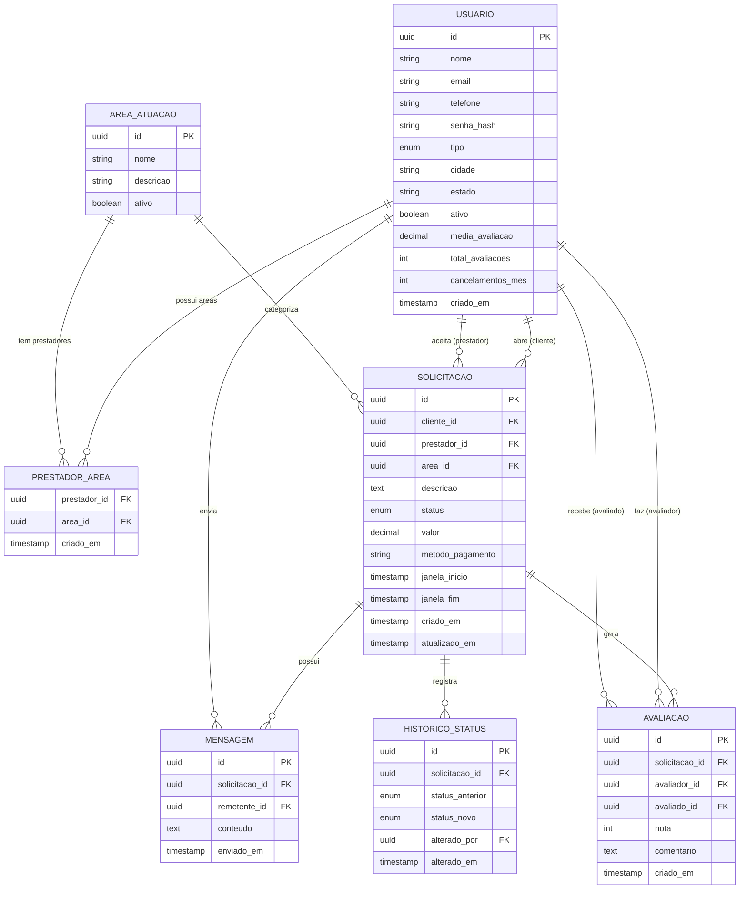

# 🔧 Service Solve

> Plataforma de marketplace para conexão entre usuários e prestadores de serviços locais.

---

## 📋 Sobre o projeto

O **Service Solve** resolve um problema simples e cotidiano: você precisa de um encanador, eletricista ou outro profissional, mas não conhece ninguém de confiança na sua região.

A plataforma conecta clientes a prestadores de serviço de forma direta, permitindo busca por categoria, negociação via chat, acompanhamento do status do serviço e avaliação mútua ao final — tudo em um único lugar.

### Fluxo principal

```
Cliente busca profissional → Envia solicitação → Prestador aceita
→ Negociação via chat (valor, horário, pagamento)
→ Prestador sinaliza deslocamento → Executa o serviço
→ Serviço concluído → Avaliação mútua
```

---

## ✅ O que está implementado

- **CRUD de usuários** — cadastro, login, perfil, endereços e telefones
- **CRUD de serviços** — criação, listagem, detalhamento, edição e exclusão
- **CRUD de categorias** — gerenciamento das categorias de serviço
- **Ciclo de vida do serviço** — controle de status com histórico de transições
- **Chat por solicitação** — mensagens de texto com polling incremental
- **Avaliação bidirecional** — cliente avalia prestador e vice-versa, com cálculo de média
- **Cancelamento com limite mensal** — controle de créditos de cancelamento por usuário
- **API REST (somente leitura)** — endpoints GET para listagem e detalhamento de usuários e serviços, com autenticação JWT
- **Testes unitários** — cobertura de models, views, forms e serializers em todos os módulos
- **CI com GitHub Actions** — pipeline automático de testes a cada push e pull request
- **Containerização** — ambiente completo com Docker e Docker Compose

---

## 🛠️ Stack

| Camada | Tecnologia |
|---|---|
| Linguagem | Python 3.12+ |
| Framework | Django 5.x |
| API | Django REST Framework (DRF) |
| Autenticação API | SimpleJWT |
| Banco de dados | PostgreSQL 16 |
| Containerização | Docker + Docker Compose |
| Testes | Django TestCase + Coverage |
| CI | GitHub Actions |

---

## 🗂️ Estrutura do projeto

```
Service_Solve/
├── core/                   # Settings, URLs, WSGI/ASGI
├── chat/                   # Mensagens por solicitação
│   ├── migrations/
│   ├── templates/
│   ├── tests/
│   ├── models.py
│   ├── urls.py
│   └── views.py
├── reviews/                # Avaliações bidirecionais
│   ├── forms/
│   ├── migrations/
│   ├── templates/
│   ├── tests/
│   ├── models.py
│   ├── urls.py
│   └── views.py
├── services/               # Solicitações e ciclo de vida do serviço
│   ├── forms/
│   ├── management/
│   ├── migrations/
│   ├── serializers/
│   ├── templates/
│   ├── tests/
│   ├── views/
│   ├── models.py
│   └── urls.py
├── users/                  # Usuários (clientes e prestadores)
│   ├── forms/
│   ├── migrations/
│   ├── serializers/
│   ├── templates/
│   ├── tests/
│   ├── views/
│   ├── models.py
│   └── urls.py
├── staticfiles/
├── docker-compose.yml
├── Dockerfile
├── entrypoint.sh
├── manage.py
└── requirements.txt
```

---

## 🚀 Como rodar localmente

### Pré-requisitos

- [Docker](https://www.docker.com/) e Docker Compose instalados

### Passo a passo

```bash
# 1. Clone o repositório
git clone https://github.com/Luisf66/Service_Solve.git
cd Service_Solve

# 2. Copie o arquivo de variáveis de ambiente
cp .env.example .env

# 3. Suba os containers
docker compose up --build
```

A aplicação estará disponível em `http://localhost:8000`.

---

## ⚙️ Variáveis de ambiente

Crie um arquivo `.env` na raiz do projeto com base no `.env.example`:

```env
DEBUG=True
SECRET_KEY=sua-secret-key-aqui

POSTGRES_DB=service_solve
POSTGRES_USER=postgres
POSTGRES_PASSWORD=postgres
POSTGRES_HOST=service_solve_db
POSTGRES_PORT=5432
```

---

## 🧪 Testes

O projeto utiliza o framework de testes nativo do Django, com testes organizados por módulo e nível (models, views, forms, serializers).

### Rodando os testes

```bash
# Todos os testes
docker compose exec service_solve python manage.py test

# Por módulo
docker compose exec service_solve python manage.py test users
docker compose exec service_solve python manage.py test services
docker compose exec service_solve python manage.py test reviews
docker compose exec service_solve python manage.py test chat
```

### Verificando cobertura

```bash
coverage run manage.py test
coverage report -m
coverage html  # gera relatório navegável em htmlcov/
```

---

## 🔁 CI — Integração Contínua

O projeto utiliza **GitHub Actions** para rodar os testes automaticamente a cada `push` ou `pull request` em qualquer branch.

O pipeline:
1. Sobe um container PostgreSQL
2. Instala as dependências
3. Roda as migrations
4. Executa todos os testes

---

## 🌐 API REST

A API atual é **somente leitura** — disponibiliza endpoints `GET` para listagem e detalhamento de recursos. Todas as rotas exigem autenticação via JWT.

### Autenticação

```
POST /api/token/          → obtém access e refresh token
POST /api/token/refresh/  → renova o access token
```

### Endpoints disponíveis

```
GET /users/api/v1/users/          → lista todos os usuários
GET /users/api/v1/users/<id>/     → detalhes de um usuário

GET /services/api/v1/services/        → lista todos os serviços
GET /services/api/v1/services/<id>/   → detalhes de um serviço
```

---

## 🗄️ Modelo de dados

As principais entidades do sistema são:

- **User** — clientes e prestadores de serviço (diferenciados pelo campo `user_type`)
- **ServiceCategory** — categorias de serviço (ex.: Encanador, Eletricista, Pintor)
- **Service** — entidade central com ciclo de vida e rastreamento de status
- **ProviderCategory** — relação N:N entre prestadores e categorias de atuação
- **ServiceStatusHistory** — auditoria de todas as transições de estado
- **Message** — chat vinculado a cada serviço
- **Review** — avaliações bidirecionais pós-conclusão

### Status do serviço

```
PENDING → ACCEPTED → SCHEDULED → IN_DISPLACEMENT → IN_PROGRESS → COMPLETED → RATED

Saídas possíveis: CANCELED_BY_CLIENT | CANCELED_BY_PROVIDER
```

### Diagrama ER



---

## 🔮 Roadmap

- [ ] Busca por geolocalização (raio em km)
- [ ] Chat em tempo real com WebSocket (Django Channels + Redis)
- [ ] Endpoints de escrita na API REST (POST, PUT, DELETE)
- [ ] Notificações (push/e-mail)
- [ ] Verificação de documentos do prestador
- [ ] Painel administrativo
- [ ] Reset automático de cancelamentos mensais (tarefa agendada)
- [ ] Mediação de pagamentos pela plataforma

---

## 📝 Licença

Este projeto está sob a licença MIT. Veja o arquivo [LICENSE](./LICENSE) para mais detalhes.
